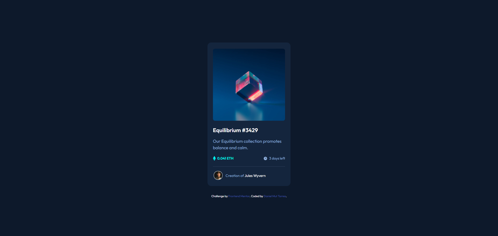

# Frontend Mentor - NFT preview card component solution

This is a solution to the [NFT preview card component challenge on Frontend Mentor](https://www.frontendmentor.io/challenges/nft-preview-card-component-SbdUL_w0U). Frontend Mentor challenges help you improve your coding skills by building realistic projects. 

## Table of contents

- [Overview](#overview)
  - [The challenge](#the-challenge)
  - [Screenshot](#screenshot)
  - [Links](#links)
- [My process](#my-process)
  - [Built with](#built-with)
  - [What I learned](#what-i-learned)
  - [Continued development](#continued-development)
  - [Useful resources](#useful-resources)
- [Author](#author)
- [Acknowledgments](#acknowledgments)

## Overview

### The challenge

Users should be able to:

- View the optimal layout depending on their device's screen size
- See hover states for interactive elements

### Screenshot



### Links

- Solution URL: [GitHub repo](https://github.com/danielMut02/nft-preview)
- Live Site URL: [Live Site](https://danielmut02.github.io/nft-preview/)

## My process

### Built with

- Semantic HTML5 markup
- CSS custom properties
- Flexbox
- Mobile-first workflow

### What I learned

While developing this project I realized that wrapping  tags within <div> elements helps a lot when giving margin and moving around your image inside a container.

```html
<div class="wrapper-bottom container">
          <div class="container-eth container">
             
            <p class="eth-amount">0.041 ETH </p> 
         </div>
```

In the CSS I managed to overcome the challenge of setting the active effect on the image by implementig this section of Code. I was ecstatic when I managed to do so.

```css
.ethe-container::before {
    content: '';
    position: absolute;
    top: 0; 
    left: 0;
    right: 0;
    bottom: 0;
    background-color: var(--Cyan_400);
    opacity: 0;
    transition: opacity 0.5s ease;
    border-radius: 0.5rem;
}

.ethe-container:hover::before {
    opacity: 0.5;
}

.view-icon{
    position: absolute;
    top: 42%;
    right: 42%;
    transition: opacity 0.3s ease;
    opacity: 0;
}

.ethe-container:hover{
    cursor: pointer;
}

.ethe-container:hover img.view-icon{
      opacity: 1;
}
```

### Continued development

### Continued development

In current projects I want to target Grid properties to continue enhancing my responsiveness abilities. Also, is my goal to develop projects including JavaScript, in order to make my websites more interactive. Later on, I will dive into JS frameworks and libraries such as ReactJS.

### Useful resources

- [DevDocs](https://devdocs.io/) - This is an amazing technical documentation site. It helped clarify some doubts I had on flex and responsiveness
- [w3schools](https://www.w3schools.com/) - This site helped with some code examples about making images responsive. Great when you don't know how to implement certain feature.

## Author

- Frontend Mentor - [@danielMut02](https://www.frontendmentor.io/profile/danielMut02)
- GitHub - [@danielMut02](https://github.com/danielMut02)

## Acknowledgments

Eternally thankful to freeCodeCamp since they served me as guidance for the web development career I am pursuing. Through their guided course for web developers I found a new passion! Also, my gratitude goes to Front End mentor for helping and creating such a wonderful platform to learn.
